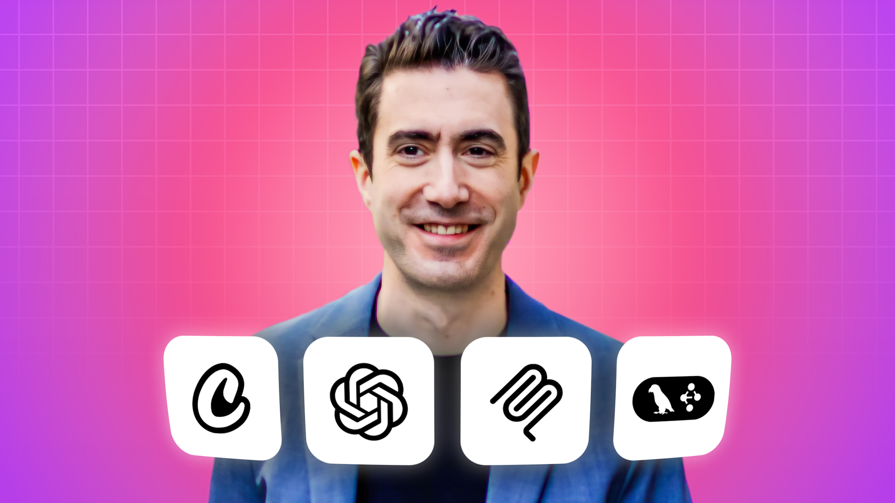

## Master AI Agentic Engineering -  build autonomous AI Agents

### 6 week journey to code and deploy AI Agents with OpenAI Agents SDK, CrewAI, LangGraph, Google ADK, Pydantic AI and MCP

_If you're looking at this in Cursor, please right click on the filename in the Explorer on the left, and select "Open preview", to view the formatted version._

I couldn't be more excited to welcome you! This is the start of your 6 week adventure into the powerful, astonishing and often surreal world of Agentic AI.

### This is the refreshed version from Summer 2026

This has fully refreshed content with the latest tools, models and techniques. Answers to common questions:  
[What changed in the upgrade?](https://edwarddonner.com/avatar?q=67)  
[Why was there an upgrade?](https://edwarddonner.com/avatar?q=65)  
[I was in the middle of the course - how do I upgrade my code](https://edwarddonner.com/avatar?q=66)  

### Answers to the most common questions

[My Cursor looks different to yours (new splash screen)](https://edwarddonner.com/avatar?q=54)  
[Can I use Gemini or free models instead of OpenAI Yes!](https://edwarddonner.com/avatar?q=8)  
[Where are the course resources](https://edwarddonner.com/2025/04/21/the-complete-agentic-ai-engineering-course/)   
[How does this course fit in with your others?](https://edwarddonner.com/curriculum)  
[Can I take this course with no programming background?](https://edwarddonner.com/avatar?q=2)  
[What job can I get after taking this course?](https://edwarddonner.com/avatar?q=3)  

### Before you begin

I'm here to help you be most successful! Please do reach out if I can help, either in the platform or by emailing me direct (ed@edwarddonner.com). It's always great to connect with people on LinkedIn to build up the community - you'll find me here:  
https://www.linkedin.com/in/eddonner/  

And my YouTube channel has many supplemental videos to add to the course; you'll find it here:  
https://youtube.com/@edward.donner

### The not-so-dreaded setup instructions

Perhaps famous last words: but I really, truly hope that I've put together an environment that will be not too horrific to set up!

- Windows people, your instructions are [here](setup/SETUP-PC.md)
- Mac people, yours are [here](setup/SETUP-mac.md)
- Linux people, yours are [here](setup/SETUP-linux.md)

Any problems, please do contact me.

### Super useful resources

- The course [resources](https://edwarddonner.com/2025/04/21/the-complete-agentic-ai-engineering-course/) with videos
- Many essential guides in the [guides](guides/01_intro.ipynb) section
- My [Avatar](https://edwarddonner.com/avatar) that can answer all common questions

### API costs - please read me!

This course does involve making calls to OpenAI and other frontier models, requiring an API key and a small spend, which we set up in the SETUP instructions. If you'd prefer not to spend on API calls, there are cheaper alternatives like DeepSeek and free alternatives like using Ollama!

Details are [here](guides/09_ai_apis_and_ollama.ipynb).

Be sure to monitor your API costs to ensure you are totally happy with any spend. For OpenAI, the dashboard is [here](https://platform.openai.com/usage).

### ABOVE ALL ELSE -

Be sure to have fun with the course! You could not have picked a better time to be learning about Agentic AI. I hope you enjoy every single minute! And if you get stuck at any point - [contact me](https://www.linkedin.com/in/eddonner/).